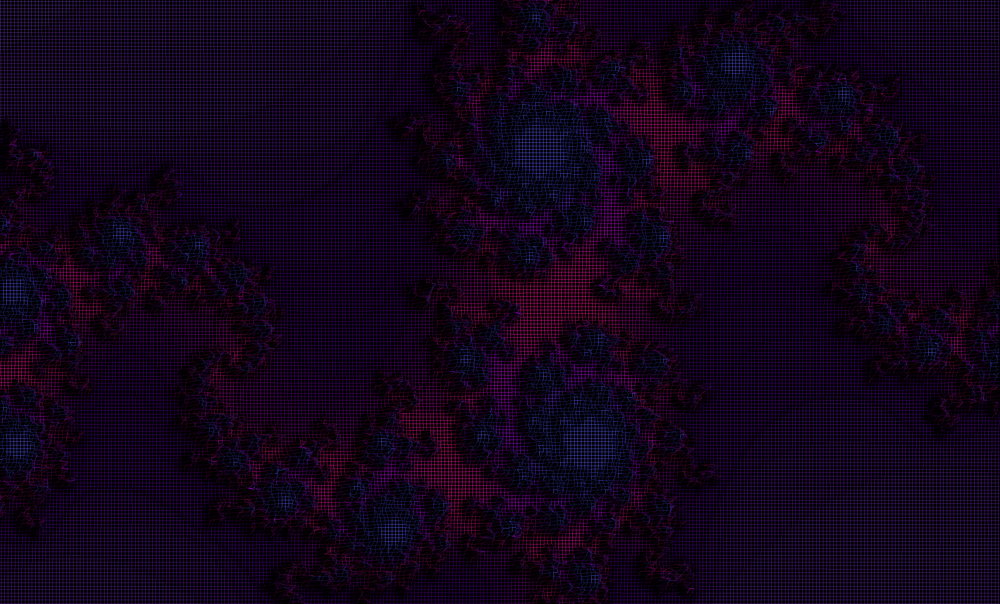

# FDF (Fil de Fer)

A 3D wireframe renderer with advanced color mapping and lighting effects, developed in accordance with the 42 School standards.

---

## Table of Contents

1. [What is FDF?](#what-is-fdf)
2. [Features](#features)
3. [Technical Details](#technical-details)
4. [Installation](#installation)
5. [Usage](#usage)
6. [File Structure](#file-structure)
7. [Credits](#credits)

---

## What is FDF?

`FDF` (Fil de Fer, French for "wireframe") is a 3D wireframe rendering engine that transforms height-map data into visually appealing three-dimensional representations. This project demonstrates a practical understanding of 3D graphics fundamentals, including coordinate transformations, projections, and color management. The implementation complies with the 42 School coding standards and follows the rules enforced by the `norminette` tool.

---

## Features

### Core Implementation

- **Standard FDF Functionality**: Isometric projection with basic height mapping
- **MLX Graphics Integration**: Cross-platform graphics rendering using MinilibX
- **File Parsing**: Robust map file parsing with error handling
- **Interactive Controls**: Real-time manipulation of 3D models

### Bonus Implementations

I went beyond the basic requirements and implemented several advanced features that significantly enhanced the project's capabilities:

#### **Advanced Projection Systems**

I developed multiple projection modes that go far beyond the standard isometric view. The implementation includes:

- **Improved Isometric Projection**: Not just basic isometric, but with smooth angle transitions and optimized matrix calculations
- **Parallel Projection**: A completely separate projection system that maintains parallel lines, perfect for architectural visualization
- **Dynamic Projection Switching**: Real-time switching between projection modes
- **Custom Matrix Operations**: I built my own matrix transformation system from scratch, implementing rotation, scaling, and translation matrices with precise floating-point calculations

#### **Color Management**

The color system I implemented is probably one of the most complex parts of the project:

- **Height-Based Color Gradients**: Colors automatically adjust based on elevation, creating a sort of visual depth
- **Non-Linear Color Interpolation**: Instead of simple linear transitions, I implemented smooth color blending using interpolation algorithms
- **Negative Height Handling**: Special color schemes for below-zero elevations, making underwater or underground features visually distinct

#### **Lighting System**

This was probably the most challenging bonus feature I implemented:

- **Rotation-Synchronized Lighting**: The light source follows the model's rotation, maintaining consistent illumination from the viewer's perspective
- **Diffuse Lighting Calculations**: Real surface normal calculations with dot product operations to determine light intensity
- **Ambient Lighting**: Ensures no surface goes completely black, maintaining visibility even in shadows
- **Gamma Correction**: Applied gamma correction for more natural-looking lighting that matches human visual perception
- **Height-Based Light Intensification**: Higher elevations receive more intense lighting, creating realistic mountain-top illumination effects

#### **Map Processing and Parsing**

- **Multi-Base Number Parsing**: I created a custom `atof_base` function that can parse colors in decimal, hexadecimal, and even binary formats
- **Multiple File Format Support**: Extended beyond basic `.fdf` format to handle maps even without the file's extension
- **Memory-Efficient Parsing**: Optimized memory allocation for large maps without performance degradation
- **Error Recovery**: Robust error handling that can recover from malformed map files
- **Dynamic Map Sizing**: Automatic scaling and centering for maps of any dimension

#### **Rendering Techniques**

- **Bresenham Algorithm Implementation**: Custom line drawing with perfect pixel accuracy and color interpolation along lines
- **Color Transitions**: Colors blend seamlessly along wireframe edges, not just at vertices
- **Optimized Drawing Pipeline**: Efficient rendering that handles complex maps without frame drops
- **Anti-Aliasing Considerations**: Implemented basic rendering techniques that minimize visual artifacts

---

## Technical Details

### Advanced Projection Mathematics

For the projection system I built, I implemented my own matrix mathematics "mini library" with:

- **4x4 Transformation Matrices**: Full homogeneous coordinate support for 3D operations
- **Euler Angle Rotations**: Smooth rotation around all three axes with proper gimbal lock prevention
- **Dynamic Projection Matrices**: Real-time calculation of projection parameters based on viewing angle and distance
- **Optimized Matrix Multiplication**: Hand-optimized matrix operations for better performance on large datasets

### Color Processing System

The color management was particularly challenging to implement correctly:

#### **Advanced Color Interpolation**

- **Non-Linear Gradients**: Instead of simple linear interpolation, I implemented smooth curves using bezier-like transitions
- **Height-Based Mapping**: Colors automatically scale based on the height range of the entire map
- **Separate Positive/Negative Palettes**: Different color schemes for above and below zero elevations
- **Gamma-Corrected Blending**: Color mixing that accounts for human visual perception

### Comprehensive Lighting Implementation

This was probably the most mathematically intensive part of the project:

#### **Surface Normal Calculations**

- **Cross Product Operations**: Calculate surface normals from adjacent vertices using vector cross products
- **Normal Smoothing**: Average normals across adjacent faces for smoother lighting transitions
- **Edge Case Handling**: Proper normal calculation even for boundary vertices

#### **Advanced Lighting Model**

- **Lambertian Reflectance**: Proper diffuse lighting using Lambert's cosine law
- **Ambient Occlusion Simulation**: Height-based ambient light reduction for more realistic shadows
- **Light Direction Synchronization**: Light vector transforms with the model rotation matrix
- **Intensity Falloff**: Distance-based light intensity calculations for depth realism

#### **Color Enhancement Algorithms**

- **HDR-Style Processing**: Tone mapping to handle high dynamic range lighting
- **Gamma Correction Pipeline**: Proper linear-to-sRGB conversion for accurate color display
- **Saturation Preservation**: Maintains color vibrancy even under intense lighting

### Enhanced Map Processing Architecture

- **Streaming Parser**: Memory-efficient parsing that can handle arbitrarily large map files
- **Validation Pipeline**: Multi-stage validation with detailed error reporting
- **Dynamic Memory Management**: Automatic allocation and deallocation based on map complexity
- **Format Flexibility**: Support for various map formats and color specification methods

### Performance Optimization Strategies

- **Spatial Indexing**: Efficient vertex lookup for large maps
- **Culling Algorithms**: Skip rendering of off-screen or occluded elements
- **Memory Pool Management**: Pre-allocated memory pools to avoid frequent malloc/free calls
- **Vectorized Operations**: Where possible, process multiple vertices simultaneously

### Development Challenges and Learning Experience

Working on the FDF bonus features was an incredible learning journey that pushed me far beyond what I initially thought possible with C and basic graphics programming.

#### **Mathematical Complexity**

The biggest challenge was definitely the mathematics behind 3D transformations and lighting. I had to really manage in a coding approach:

- **Linear Algebra**: Matrix operations, vector math, and coordinate system transformations
- **Geometry**: Surface normal calculations, angle computations, and spatial relationships
- **Color Theory**: How human vision perceives color and light, gamma correction, and color space conversions

I spent countless hours debugging matrix multiplications where a single sign error would cause the entire model to flip or disappear. The breakthrough came when I started visualizing each transformation step by step.

#### **Memory Management Challenges**

Managing memory efficiently while handling large maps was particularly tricky. I had to:

- **Profile Memory Usage**: Track allocation patterns to identify leaks and inefficiencies
- **Implement Custom Allocators**: Create memory pools for frequently allocated/deallocated objects
- **Optimize Data Structures**: Choose the right data layout for cache efficiency

The most frustrating bug was a subtle memory corruption that only appeared with maps larger than 100x100 vertices. It took me three days to track down to an off-by-one error in my index calculations.

#### **Precision and Floating-Point Arithmetic**

Working with floating-point numbers for color blending and transformations taught me about:

- **Numerical Stability**: How small errors accumulate through multiple operations
- **Epsilon Comparisons**: Why you can never directly compare floating-point numbers
- **Range Handling**: Ensuring calculations stay within valid color and coordinate ranges

#### **Cross-Platform Compatibility**

Getting the same visual results across different systems was more challenging than expected:

- **MLX Differences**: Subtle behavior differences between MLX implementations
- **Color Representation**: Different systems handle color spaces differently
- **Performance Variations**: Optimization techniques that work well on one architecture might not on another

#### **Algorithm Implementation from Scratch**

Rather than relying on external libraries, I implemented everything from the ground up:

- **Bresenham Line Algorithm**: For precise pixel-perfect line drawing with color interpolation
- **Matrix Operations**: All transformation matrices built from mathematical first principles
- **Color Space Conversions**: RGB to HSL and back, with proper gamma handling
- **Numerical Parsing**: Custom atof function that handles multiple number bases

This approach was much more work, but it gave me a deep understanding of how these algorithms actually function.

#### **Debugging Complex Visual Issues**

Debugging graphics code is completely different from debugging regular algorithms:

- **Visual Debugging**: Sometimes the bug is obvious visually but hard to trace in code
- **Mathematical Verification**: Double-checking mathematical formulas against reference implementations
- **Edge Case Testing**: Ensuring the system works with degenerate cases like flat maps or extreme height values

This project taught me that graphics programming is as much about mathematics and physics as it is about coding. Every visual effect has underlying mathematical principles that need to be understood and implemented correctly.

The bonus features transformed what could have been a basic wireframe renderer into a sophisticated 3D visualization tool. I'm particularly proud of the lighting system, even if I know its limitations and that it's not something truly sophisticated compared to professional rendering engines. At a certain point, I decided to stop adding features because I was implementing all these bonus elements that were "extras" beyond what the project actually required.

However, I can see the potential - if one really wanted to, FDF could be evolved into a truly incredible project. The foundation is there: the matrix mathematics, the rendering pipeline, the modular architecture. With more time and without the constraints of a school project, it could incorporate advanced features like real-time shadows, texture mapping, mesh subdivision, or even basic ray tracing. But for the scope of this 42 project, I'm satisfied with what I achieved - it demonstrates solid understanding of 3D graphics fundamentals while staying within reasonable bounds.

---

## Visual Examples

The following examples showcase the advanced rendering capabilities and various features implemented in the FDF project:

### T2 Terrain Visualization

This example demonstrates the sophisticated terrain rendering with height-based color gradients and advanced lighting systems:

#### Complete View

*T2 terrain map showing the full landscape with isometric projection, height-based color mapping, and integrated lighting system*

#### Detailed View (Zoomed)

*Close-up detail of T2 terrain highlighting the precision of wireframe rendering, color interpolation along edges, and lighting effects on individual surface elements*

### Julia Set Fractal Rendering

This example showcases the mathematical precision and color management capabilities when rendering complex fractal geometries:

#### Complete View

*Julia set fractal rendered as 3D wireframe, demonstrating the advanced color gradient system and mathematical precision of the height mapping*

#### Detailed View (Zoomed)

*Detailed view of Julia set fractal showing the intricate wireframe precision, smooth color transitions, and the complex mathematical structures rendered with pixel-perfect accuracy*

---

## Installation

Clone the repository:

```bash
git clone https://github.com/deunen/FDF.git
cd fdf
```

Build the project:

```bash
make
```

For bonus features:

```bash
make bonus
```

This will generate the `fdf` executable.

---

## Usage

1. Run the program with a height-map file:

   ```bash
   ./fdf maps/42.fdf
   ```

2. **Advanced Control System** (Bonus Features):

   #### **Basic Navigation**

   - **Arrow Keys**: Translate the view (pan around the map)
   - **+/- (or =/−)**: Zoom in and out
   - **ESC**: Exit the application

   #### **Projection Modes** (Bonus)

   - **i**: Switch to Isometric projection (3D perspective view)
   - **p**: Switch to Parallel projection (orthographic view)
   - **b**: Switch to Custom projection with specialized rotation angles

   #### **Advanced Rendering Controls** (Bonus)

   - **w/a/s/d**: Rotate the map around X and Y axes (disabled in parallel projection)
   - **j/k**: Rotate around Z-axis
   - **f/g**: Adjust height scaling factor (increase/decrease)

   Note: The rotation controls (w/a/s/d) are automatically disabled when using parallel projection to maintain the orthographic view's characteristics.

3. **Map Format Examples**:

   The program supports various map formats with my custom multi-base parsing system:

   **Basic Height Map:**

   ```
   0  0  0  0  0
   0  1  2  1  0
   0  2  4  2  0
   0  1  2  1  0
   0  0  0  0  0
   ```

   **With Decimal Z-values:**

   ```
   0    10   20   10    0
   10   15   25   15   10
   20   25   30   25   20
   10   15   25   15   10
   0    10   20   10    0
   ```

   **With Hexadecimal Heights:**

   ```
   0x0   0xA   0x14   0xA   0x0
   0xA   0xF   0x19   0xF   0xA
   0x14  0x19  0x1E   0x19  0x14
   ```

   **With Binary Heights (Advanced Parsing):**

   ```
   0b0      0b1010   0b10100
   0b1010   0b1111   0b11001
   0b10100  0b11001  0b11110
   ```

   **Mixed Format Support:**

   My custom `atof_base` function supports mixing different number formats within the same map, and even fractional heights using decimal points or commas as separators.

   ```
   0      1.5    0x10    0b1010
   2.0    3.14   0xF     0b1111
   ```

4. **Performance Tips**:

   - Large maps (>200x200) benefit from the optimized rendering pipeline
   - Use the parallel projection for architectural visualizations
   - Enable lighting for realistic mountain and terrain visualization
   - The color gradient system automatically adapts to your map's height range

5. **Advanced Features Demo**:
   Try these maps to see the bonus features in action:
   - `maps/mars.fdf` - Great for testing the lighting system
   - `maps/julia.fdf` - Shows off the advanced color interpolation
   - `maps/42.fdf` - Perfect for demonstrating projection switching
   - `maps/pyramide.fdf` - Excellent for testing negative height handling

---

## File Structure

```
fdf/
├── includes/                  # Header files
│   ├── fdf.h                  # Main project definitions and structures
│   ├── colors.h               # Color system and lighting definitions
│   ├── ft_printf.h            # Custom printf implementation
│   ├── ft_printf_utils.h      # Printf utility functions
│   └── get_next_line.h        # File reading utilities
├── srcs/                      # Source files
│   ├── main.c                 # Program entry point and initialization
│   ├── matrix.c               # Matrix creation and transformation operations
│   ├── point.c                # Point transformation and projection functions
│   ├── point_utils.c          # Additional point manipulation utilities
│   ├── map.c                  # Standard map rendering and drawing
│   ├── map_bonus.c            # Enhanced map rendering with advanced features
│   ├── standard_projections.c # Basic isometric projection implementation
│   ├── standard_projection_bonus.c # Advanced projection systems
│   ├── mymlx.c                # Core MLX interface and window management
│   ├── mymlx_utils.c          # MLX utility functions and helpers
│   ├── mymlx_bonus.c          # Extended MLX features and advanced controls
│   ├── mymlx_utils_bonus.c    # Advanced MLX utilities and optimizations
│   ├── colors.c               # Core color processing and height-based gradients
│   ├── colors_utility.c       # Color manipulation and interpolation utilities
│   ├── colors_lighting.c      # Advanced lighting system implementation
│   ├── bresenham_algorithm.c  # Line drawing with color interpolation
│   ├── io_manage.c            # File I/O operations and map loading
│   ├── check.c                # Primary input validation and error checking
│   ├── check_utility.c        # Additional validation functions
│   ├── check_add.c            # Extended validation for complex inputs
│   ├── char_utility.c         # Character processing and string utilities
│   ├── atof_base.c            # Multi-base number parsing (decimal, hex, binary)
│   ├── atof_base_utility.c    # Utilities for advanced number parsing
│   ├── get_next_line.c        # Efficient file reading implementation
│   ├── get_next_line_utils.c  # Utilities for line-by-line file processing
│   ├── ft_printf.c            # Custom printf implementation
│   ├── ft_printf_proc.c       # Printf processing functions
│   └── ft_printf_utils.c      # Printf utility and formatting functions
├── maps/                      # Example height maps for testing
│   ├── 42.fdf                 # Classic 42 logo map
│   ├── mars.fdf               # Martian terrain simulation
│   ├── julia.fdf              # Julia set fractal representation
│   ├── pyramide.fdf           # Pyramid structure with negative heights
│   ├── elem.fdf               # Basic elements testing
│   ├── elem-col.fdf           # Color specification examples
│   ├── plat.fdf               # Flat terrain with variations
│   ├── pyra.fdf               # Multi-level pyramid
│   └── [additional test maps] # Various complexity and feature tests
├── libft/                     # Custom C library implementation
├── mlx_linux/                 # MinilibX for Linux systems
└── fdf_README.md              # Detailed technical documentation (this file)
```

### Key File Descriptions

#### **Core Engine Files**

- `main.c`: Program initialization, argument parsing, and main execution loop
- `matrix.c`: Complete 3D transformation matrix implementation from scratch
- `mymlx*.c`: Comprehensive graphics interface with cross-platform compatibility

#### **Advanced Rendering System**

- `standard_projection_bonus.c`: Multiple projection modes with smooth transitions
- `colors_lighting.c`: Sophisticated lighting model with gamma correction
- `bresenham_algorithm.c`: Precise line drawing with interpolated color transitions
- `map_bonus.c`: Enhanced rendering pipeline with performance optimizations

#### **Parsing and Validation**

- `atof_base.c` & `atof_base_utility.c`: Multi-format number parsing system
- `check*.c`: Comprehensive input validation with detailed error reporting
- `io_manage.c`: Robust file I/O with memory-efficient map loading

#### **Utility and Support**

- `colors*.c`: Advanced color management with height-based mapping
- `point*.c`: 3D point transformation and coordinate system management
- Custom `ft_printf`: Full printf implementation for consistent cross-platform output

---

## Credits

Developed by [deunen](https://github.com/deunen) as part of the 42 School curriculum. Special thanks to the 42 community for guidance and support during development.

---
